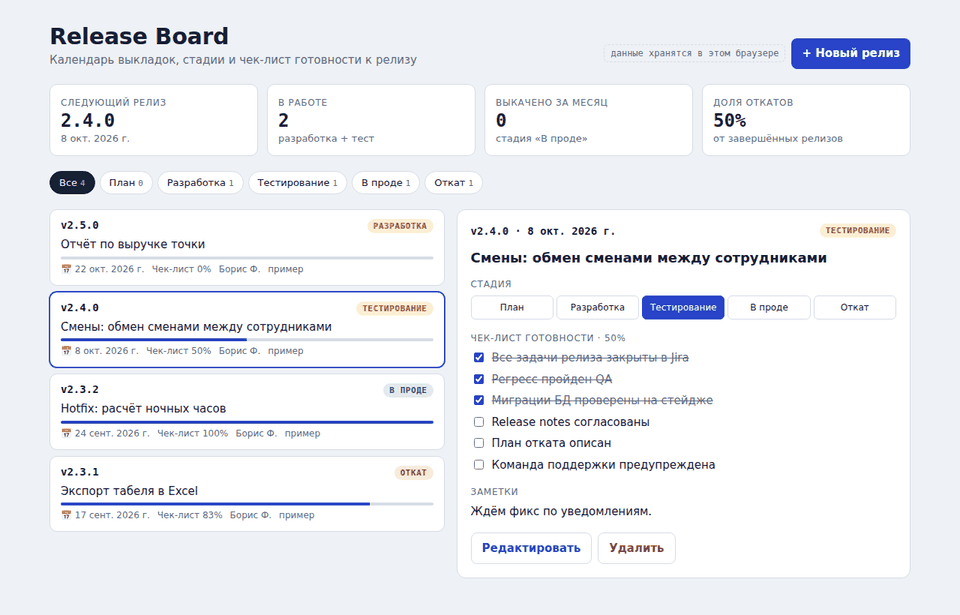
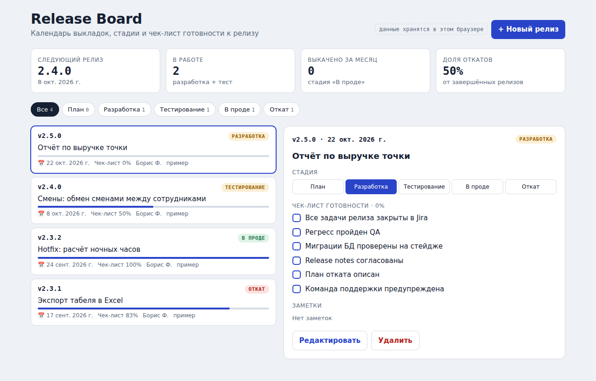
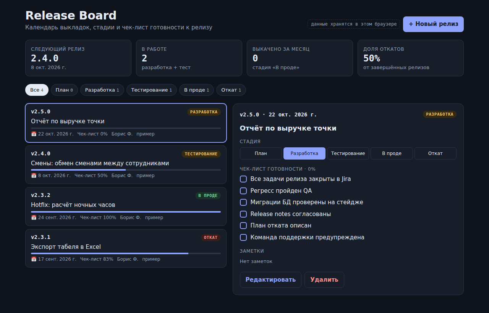
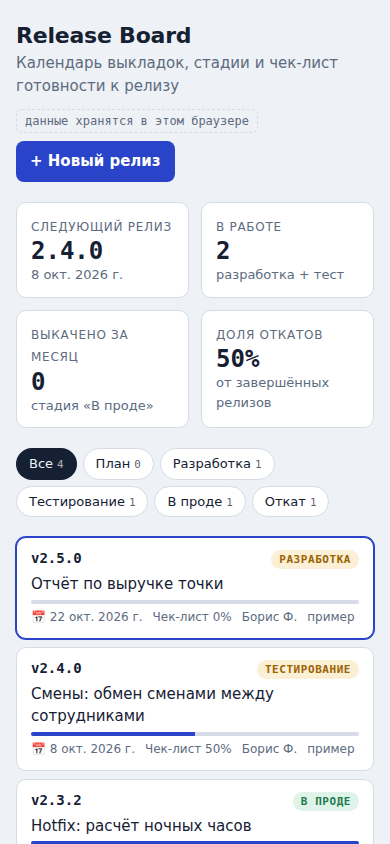

<div align="center">

# 🚀 Release Board

**Трекер релизов для продуктовой команды: стадии, чек-лист готовности и метрики на одном экране**

[](https://yaki-gl.github.io/release-board/)
[](https://github.com/YaKi-gl/release-board/actions/workflows/deploy.yml)


### [▶ Открыть демо](https://yaki-gl.github.io/release-board/)



</div>

---

## 📌 Содержание

- [О проекте](#-о-проекте)
- [Для кого и зачем](#-для-кого-и-зачем)
- [Возможности](#-возможности)
- [Анимации](#-анимации)
- [Скриншоты](#-скриншоты)
- [Стек технологий](#-стек-технологий)
- [Архитектура](#-архитектура)
- [Быстрый старт](#-быстрый-старт)
- [Тесты и CI/CD](#-тесты-и-cicd)
- [Roadmap](#-roadmap)
- [Автор](#-автор)

---

## 💡 О проекте

**Release Board** — веб-приложение, в котором видно, какие релизы сейчас в работе, когда выкладка и что ещё мешает выкатиться в прод.

Идея выросла из моей работы **релиз-менеджером** во внутреннем сервисе смен и зарплат для сети кофеен. Релизы там планировались в Jira и Confluence, а общий ответ на вопрос «что и когда едет в прод» приходилось собирать вручную. Release Board сводит его на одну страницу.

## 🎯 Для кого и зачем

| Кто | Какую задачу решает |
|---|---|
| **Релиз-менеджер** | Видит все релизы, их стадии и даты в одном месте и не собирает статус по чатам |
| **Тимлид / PM** | Быстро понимает, что блокирует выкладку: в каждом релизе есть чек-лист готовности |
| **QA и поддержка** | Знают, когда ждать новую версию и что в неё входит |

**Главная ценность:** меньше забытых шагов перед выкладкой, а значит, меньше откатов. Доля откатов вынесена в метрики, чтобы следить за качеством процесса.

## ✨ Возможности

- 📊 **Сводка**: следующий релиз, число релизов в работе, выкачено за месяц, доля откатов
- 🔀 **Конвейер стадий**: `План → Разработка → Тестирование → В проде → Откат`. Работает как фильтр и как переключатель
- ✅ **Чек-лист готовности** для каждого релиза: задачи в Jira, регресс QA, миграции БД, release notes, план отката, предупреждение поддержки
- 🎉 Когда чек-лист закрыт на 100%, появляется бейдж «готов к релизу» и конфетти
- ✏️ Создание, редактирование и удаление релизов с подтверждением
- 💾 Данные сохраняются в браузере (`localStorage`)
- 🌗 Светлая и тёмная тема, адаптив под телефон, уважение к настройке «уменьшить движение»

## 🎬 Анимации

| Где | Что происходит | Как сделано |
|---|---|---|
| Фильтр стадий | Тёмная «таблетка» перетекает к выбранной стадии | Shared layout: `layoutId` |
| Список релизов | Карточки плавно перестраиваются при фильтрации | `layout` + `AnimatePresence mode="popLayout"` |
| Сводка | Карточки появляются каскадом, числа «докручиваются» | `staggerChildren`, `animate()` для чисел |
| Чек-лист | Галочка рисуется штрихом | SVG `pathLength` 0 → 1 |
| Прогресс | Полоса заполняется пружиной | `type: "spring"` |
| Готовность 100% | Бейдж «выпрыгивает», разлетается конфетти | Пружина + 24 частицы по «золотому углу» |
| Правая панель | Карточка и форма сменяют друг друга со сдвигом | `AnimatePresence mode="wait"` |
| Удаление | Плашка подтверждения раскрывается с «тряской» | Keyframes `x: [0, -6, 6, -3, 0]` |

## 🖼 Скриншоты

| Светлая тема | Тёмная тема |
|---|---|
|  |  |

<details>
<summary>📱 Мобильная версия</summary>
<br>

</details>

## 🛠 Стек технологий

| Слой | Технология | Для чего |
|---|---|---|
| UI | **React 19** | Компонентный интерфейс, хуки `useReducer`, `useMemo`, `useEffect` |
| Анимации | **Framer Motion 12** | Layout-анимации, `AnimatePresence`, пружины, жесты `whileHover` / `whileTap` |
| Сборка | **Vite 7** | Быстрый dev-сервер с HMR и оптимизированная production-сборка |
| Стили | **CSS** (Custom Properties, Grid, Flexbox) | Дизайн-токены, светлая и тёмная тема, адаптив. У каждого компонента свой `.css` |
| Тесты | **Vitest** | Юнит-тесты бизнес-логики и редьюсеров |
| Качество кода | **ESLint** + `eslint-plugin-react-hooks` | Правила хуков и единый стиль |
| CI/CD | **GitHub Actions** → **GitHub Pages** | На каждый push: тесты → сборка → деплой |
| Разработка | **Claude (AI-ассистент)** | Вайбкодинг: генерация и доработка кода по моим требованиям |

## 🏗 Архитектура

```
src/
├── main.jsx                      # точка входа, MotionConfig
├── App.jsx                       # компоновка экрана
├── config/stages.js              # стадии релиза, шаблон чек-листа
├── data/seed.js                  # демо-данные для первого запуска
├── store/
│   ├── releasesReducer.js        # вся логика изменения данных (чистая функция)
│   └── releasesReducer.test.js
├── hooks/useReleaseBoard.js      # useReducer + автосохранение + готовые actions
├── services/
│   ├── metrics.js                # бизнес-метрики: готовность, доля откатов…
│   ├── metrics.test.js
│   └── storage.js                # localStorage (легко заменить на API)
├── utils/format.js               # даты, id, сортировка
├── styles/                       # tokens.css (темы) + global.css
└── components/
    ├── Header/                   # заголовок и кнопка «Новый релиз»
    ├── StatsBar/                 # KPI-карточки
    ├── StageFilter/              # фильтр по стадиям
    ├── ReleaseList/              # список + карточка релиза в списке
    ├── ReleaseCard/              # детали: StageSwitch, Checklist
    ├── ReleaseForm/              # форма создания и редактирования
    ├── motion/presets.js         # общие настройки анимаций
    └── ui/                       # StageChip, ProgressBar, AnimatedNumber, Confetti, EmptyState
```

**Поток данных** однонаправленный:

```
 клик ─▶ actions (hook) ─▶ dispatch ─▶ releasesReducer ─▶ новый state ─▶ компоненты
                                                              │
                                                              └─▶ storage.saveReleases()
```

| Слой | Ответственность |
|---|---|
| `store/` | Единственное место, где меняются данные. Чистые функции, покрыты тестами |
| `services/` | Бизнес-логика и хранение без React. Хранилище можно заменить на API, не трогая UI |
| `hooks/` | Связывает React с редьюсером и хранилищем, отдаёт компонентам готовые действия |
| `components/` | Только отображение и анимации. Каждый компонент в своей папке со своими стилями |

## ⚡ Быстрый старт

Нужен [Node.js](https://nodejs.org/) 20 или новее.

```bash
git clone https://github.com/YaKi-gl/release-board.git
cd release-board
npm install
npm run dev        # http://localhost:5173/release-board/
```

| Команда | Что делает |
|---|---|
| `npm run dev` | Dev-сервер с горячей перезагрузкой |
| `npm test` | Запуск юнит-тестов (Vitest) |
| `npm run build` | Production-сборка в `dist/` |
| `npm run preview` | Локальный просмотр собранной версии |
| `npm run lint` | Проверка кода ESLint |

## ✅ Тесты и CI/CD

Покрыты юнит-тестами: расчёт метрик (`metrics.test.js`) и все действия редьюсера (`releasesReducer.test.js`).

Каждый push в `main` запускает workflow [`.github/workflows/deploy.yml`](.github/workflows/deploy.yml):

```
push → npm install → npm test → npm run build → деплой на GitHub Pages
```

Если хоть один тест падает, сломанная версия на сайт не попадёт.

## 🗺 Roadmap

- [x] Стадии релиза, фильтрация, чек-лист готовности
- [x] Метрики: доля откатов, выкладки за месяц
- [x] React + Vite, анимации Framer Motion, тесты, CI/CD
- [ ] Календарный вид выкладок
- [ ] Импорт задач из Jira (CSV)
- [ ] Генерация release notes по задачам релиза
- [ ] Общая база для команды (бэкенд)

## 🤖 Как сделано

Проект собран в формате **вайбкодинга**: я формулировал требования, проверял результат и итеративно дорабатывал его вместе с AI-ассистентом. Продуктовая часть моя: сценарии, данные и метрики взяты из моего реального опыта.

## 👤 Автор

**Борис Фролов** — Release Manager

[](https://github.com/YaKi-gl)

---

<div align="center">

⭐ Если проект показался полезным, поставьте звезду

</div>
